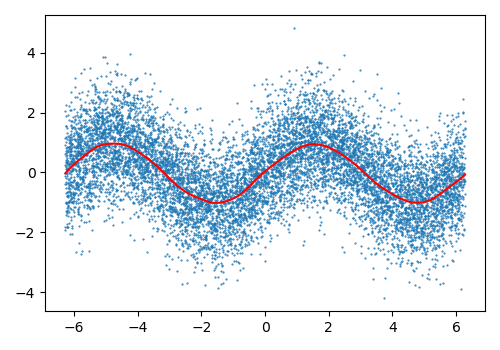
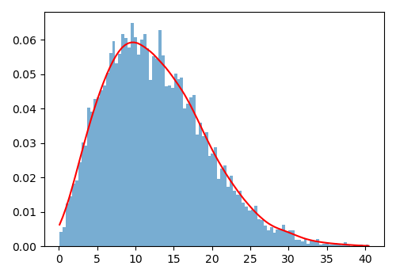

# lowesslib
Highly optimized LOWESS utilities for Python

This is a small python library for evaluating local regression, also known as
Locally Weighted Scatterplot Smoothing ([LOWESS](https://en.wikipedia.org/wiki/Local_regression)).

To acheive the best performance I'm making use of [OpenMP](www.openmp.org) and
[AVX](https://en.wikipedia.org/wiki/AVX-512) instructions.

## Requirements

* [pybind11](https://github.com/pybind/pybind11) - for the C++ to python interface

## Installation

```
pip install .
```

## Performance

We can compare performance with the `smoothers_lowess` module from
[statsmodels](https://www.statsmodels.org/dev/generated/statsmodels.nonparametric.smoothers_lowess.lowess.html#).

```python
import numpy as np
import statsmodels.api as sm
import lowesslib

x  = np.random.uniform(low = -2*np.pi, high = 2*np.pi, size=10_000)
y  = np.sin(x) + np.random.normal(size=len(x))
xi = np.linspace(-2*np.pi, 2*np.pi, 100)

%timeit sm.nonparametric.lowess(endog=y, exog=x, xvals=xi)
%timeit lowesslib.smooth(x, y, xi, bandwidth=0.4)
```

Results are quite dramatic, over 20,000 times faster than `statsmodels`.

```
statsmodels:
2.13 s ± 7.46 ms per loop (mean ± std. dev. of 7 runs, 1 loop each)

lowesslib:
99.5 µs ± 1.37 µs per loop (mean ± std. dev. of 7 runs, 10,000 loops each)
```
## Examples

### Kernel Smoothing

For the `smooth` example above we get the following results:

```python
figure(figsize=(5,3.5))
plot(x, y, '.', ms=1)
plot(*lowesslib.smooth(x, y, xi, bandwidth=0.4), color='r')
tight_layout()
```



### Kernel Density Estimation

We can use `histogram` to smooth out density histograms:

```python
x = np.random.rayleigh(scale=10, size=10_000)
figure(figsize=(5,3.5))
hist(x, bins=100, density=True, alpha=.6);
plot(*lowesslib.histogram(x, bandwidth=1.5), color='r')
tight_layout()
```

