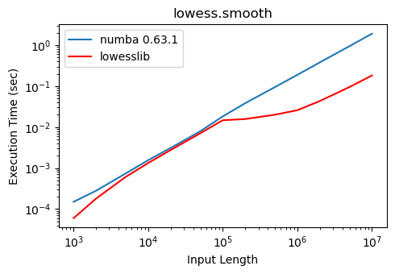
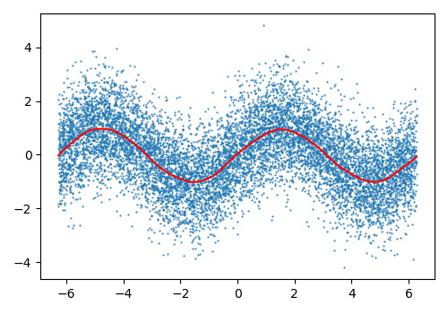
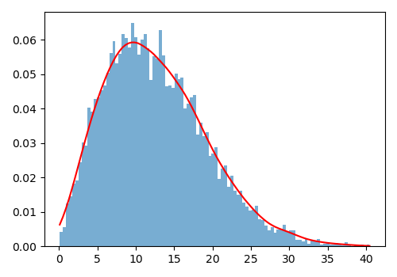

# lowesslib
Highly optimized LOWESS utilities for Python

This is a small python library for evaluating local regression, also known as
Locally Weighted Scatterplot Smoothing ([LOWESS](https://en.wikipedia.org/wiki/Local_regression)).

It uses [OpenMP](https://www.openmp.org) and [AVX](https://en.wikipedia.org/wiki/AVX-512)
instructions for best performance.

For computing `expectile` it makes use of a third-party Nelder-Mead solver,
available via a git submodule.

## Requirements

* A C++17 compiler
* [OpenMP](https://www.openmp.org)
* [pybind11](https://github.com/pybind/pybind11)

## Installation

This repo uses a git submodule for the Nelder-Mead solver, so make sure to
clone recursively:

```bash
git clone --recurse-submodules <repo-url>
cd lowesslib
pip install .
```

If you've already cloned without `--recurse-submodules`, you can fetch it after
the fact with:

```bash
git submodule update --init
```

## Performance

Here's a comparison against the `smoothers_lowess` module from
[statsmodels](https://www.statsmodels.org/dev/generated/statsmodels.nonparametric.smoothers_lowess.lowess.html#).

```python
import numpy as np
import statsmodels.api as sm
import lowesslib

x  = np.random.uniform(low = -2*np.pi, high = 2*np.pi, size=10_000)
y  = np.sin(x) + np.random.normal(size=len(x))
xi = np.linspace(-2*np.pi, 2*np.pi, 100)

%timeit sm.nonparametric.lowess(endog=y, exog=x, xvals=xi)
%timeit lowesslib.smooth(x, y, xi, bandwidth=0.4)
```

On this benchmark, `lowesslib` is over 20,000 times faster than `statsmodels`.

```
statsmodels:
2.13 s ± 7.46 ms per loop (mean ± std. dev. of 7 runs, 1 loop each)

lowesslib:
99.5 µs ± 1.37 µs per loop (mean ± std. dev. of 7 runs, 10,000 loops each)
```

## Dropping NaNs

By default, `lowesslib` checks for and drops NaNs and Infs. This can slow things
down for large datasets, so you can disable this with `dropna=False`.

```python
n = 10_000_000
x = np.random.randn(n)
y = x + np.random.randn(n)

%time _ = lowesslib.smooth(x, y)
# CPU times: user 1.67 s, sys: 50.5 ms, total: 1.72 s
# Wall time: 257 ms

%time _ = lowesslib.smooth(x, y, dropna=False)
# CPU times: user 1.59 s, sys: 6.92 ms, total: 1.6 s
# Wall time: 162 ms
```

## Comparison with Numba

How does this compare against multi-threaded `numba`? We outperform it by an
order of magnitude. For this test we disabled checks for NaNs. There's a
visible discontinuity at 100,000 items, caused by the maximum size of the sort
used for estimating interpolation locations and bandwidth (see `MAX_SIZE` in
`subsample_sort`). This could be optimized further.



## Examples

### Kernel Smoothing

For the `smooth` example above, here's what the output looks like:

```python
figure(figsize=(5,3.5))
plot(x, y, '.', ms=1)
plot(*lowesslib.smooth(x, y, xi, bandwidth=0.4), color='r')
tight_layout()
```



### Kernel Density Estimation

We can use `histogram` to smooth out density histograms:

```python
x = np.random.rayleigh(scale=10, size=10_000)
figure(figsize=(5,3.5))
hist(x, bins=100, density=True, alpha=.6)
plot(*lowesslib.histogram(x, bandwidth=1.5), color='r')
tight_layout()
```

